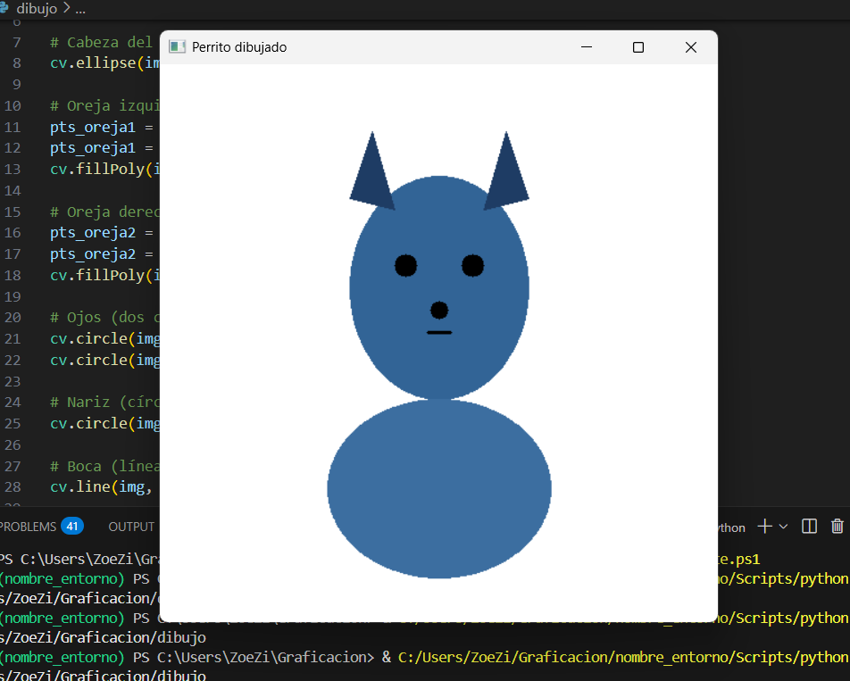

este es el README limpio que te daré más abajo

# Dibujo con figuras

En este proyecto usaremos figuras geométricas básicas para crear un dibujo sencillo desde cero.

---

## Captura de pantalla del programa funcionando



---


## Código principal (comentado paso a paso)

```python
import cv2 as cv
import numpy as np

# Crear fondo blanco
img = np.ones((500, 500, 3), dtype=np.uint8) * 255

# Cabeza del perro (óvalo)
cv.ellipse(img, (250, 200), (80, 100), 0, 0, 360, (150, 100, 50), -1)

# Oreja izquierda (triángulo)
pts_oreja1 = np.array([[170, 120], [190, 60], [210, 130]], np.int32)
pts_oreja1 = pts_oreja1.reshape((-1, 1, 2))
cv.fillPoly(img, [pts_oreja1], (100, 60, 30))

# Oreja derecha (triángulo)
pts_oreja2 = np.array([[290, 130], [310, 60], [330, 120]], np.int32)
pts_oreja2 = pts_oreja2.reshape((-1, 1, 2))
cv.fillPoly(img, [pts_oreja2], (100, 60, 30))

# Ojos (dos círculos)
cv.circle(img, (220, 180), 10, (0, 0, 0), -1)  # ojo izquierdo
cv.circle(img, (280, 180), 10, (0, 0, 0), -1)  # ojo derecho

# Nariz (círculo)
cv.circle(img, (250, 220), 8, (0, 0, 0), -1)

# Boca (línea)
cv.line(img, (240, 240), (260, 240), (0, 0, 0), 2)

# Cuerpo (elipse más grande)
cv.ellipse(img, (250, 380), (100, 80), 0, 0, 360, (160, 110, 60), -1)

# Mostrar ventana
cv.imshow("Perrito dibujado", img)
cv.waitKey(0)
cv.destroyAllWindows()

